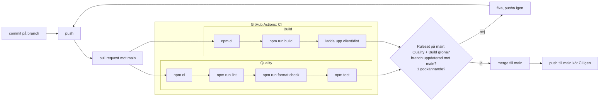

## CI flödesdiagram



## CI Tidsmätning

```bash
== Quality
0s      Set up job
1s      Run actions/checkout@v4
1s      Run actions/setup-node@v4
6s      Run npm ci
1s      Run npm run lint
1s      Run npm run format:check
2s      Run npm test
0s      Post Run actions/setup-node@v4
0s      Post Run actions/checkout@v4
0s      Complete job
== Build
1s      Set up job
0s      Run actions/checkout@v4
1s      Run actions/setup-node@v4
6s      Run npm ci
2s      Run npm run build
1s      Run actions/upload-artifact@v4
0s      Post Run actions/setup-node@v4
0s      Post Run actions/checkout@v4
0s      Complete job
```
